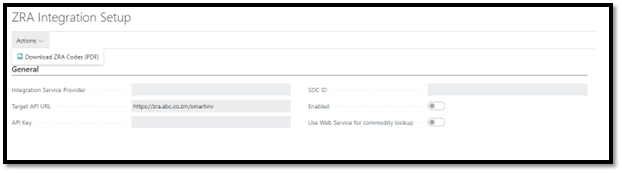

### 2.1 Integration Setup

1. Open the ZRA Integration Setup menu.
2. Select the **Integration Service Provider**
3. Confirm that the **Target API URL** is correct for the Service Provider
4. Enter the following fields 
    1. **API Key**
    2. **SDC ID**
5. Lastly, **Enable** the integration
6. If you want to host the list of commodity codes locally in the database, you can leave the **Use Web Service for commodity lookup** field disabled. Not all service providers do, but if the chosen Service Provider does support commodity code lookup, you can enable this feature.

>The user can download a copy of ZRA Codes used for mapping in the system as described in this document.
